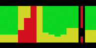

# ping-menubar

A minimal macOS menubar app that displays real-time ping times as a compact visualization.

<div style="display: flex; gap: 10px;">
  
</div>

## Installation Options

### Quick Start (Run from Python)
```bash
# Optional: Set up virtual environment
python3 -m venv venv
source venv/bin/activate

# Install dependencies
pip install -r requirements.txt

# Run directly
python ping-menubar.py
```

### Install as App (required to launch at login)
```bash
# Install build dependencies
pip install -r requirements.txt
pip install setuptools==70.3.0
pip install py2app

# Build app
python3 setup.py py2app

# Copy to Applications
cp -r "dist/ping-menubar.app" /Applications/
```

### Create dmg for distribution
```bash
# Install create-dmg
brew install create-dmg

# Build dmg
rm ping-menubar.dmg; create-dmg \
  --volname "Ping Menubar" \
  --window-size 400 160 \
  --icon-size 50 \
  --app-drop-link 270 100 \
  --icon "ping-menubar.app" 90 100 \
  "ping-menubar.dmg" dist
```
